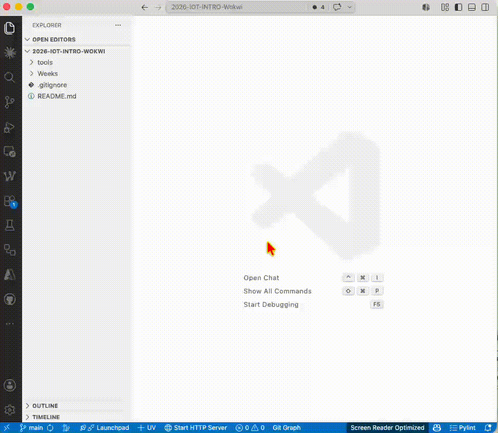

# Week 12

> 本週（Week 12）是本課程第一次使用 Wokwi 進行程式實作。

## 1. 在 Visual Studio 中安裝 Wokwi




## 2. 環境準備

安裝 pyserial（只需安裝一次）：

```bash
python -m pip install pyserial
```

## 3. 執行方式（每個 Task 通用）

1. 用 VS Code 開啟對應的 Task 資料夾
2. Command Palette（`Cmd+Shift+P`）→ `Wokwi: Start Simulator`
3. 確認模擬器視窗保持開啟，在另一個 Terminal 執行：

```bash
make
```

## 4. 本週課堂作業

| Task | 主題 | 核心概念 |
|------|------|----------|
| [Task 1](in-class/task1/task1.md) | Hello World | `print()`、驗證環境 |
| [Task 2](in-class/task2/task2.md) | LED 閃燈（外接電阻） | GPIO 輸出、`time.sleep()` |
| [Task 3](in-class/task3/task3.md) | 雙 LED 不同頻率 | 非阻塞計時 `ticks_ms()` |
| [Task 4](in-class/task4/task4.md) | 四 LED 多裝置管理 | list 管理多裝置 |

## 5. 回家作業

| 作業 | 主題 | 說明 |
|------|------|------|
| [Knight Rider](homework/knight-rider/task.md) | 跑馬燈 | 4 顆 LED 來回掃描 |

## 6. 繳交規定

- 本週解答請放在：`solutions/<你的學號>/`
- 送 PR 前請確認：檔案路徑正確、程式可執行
