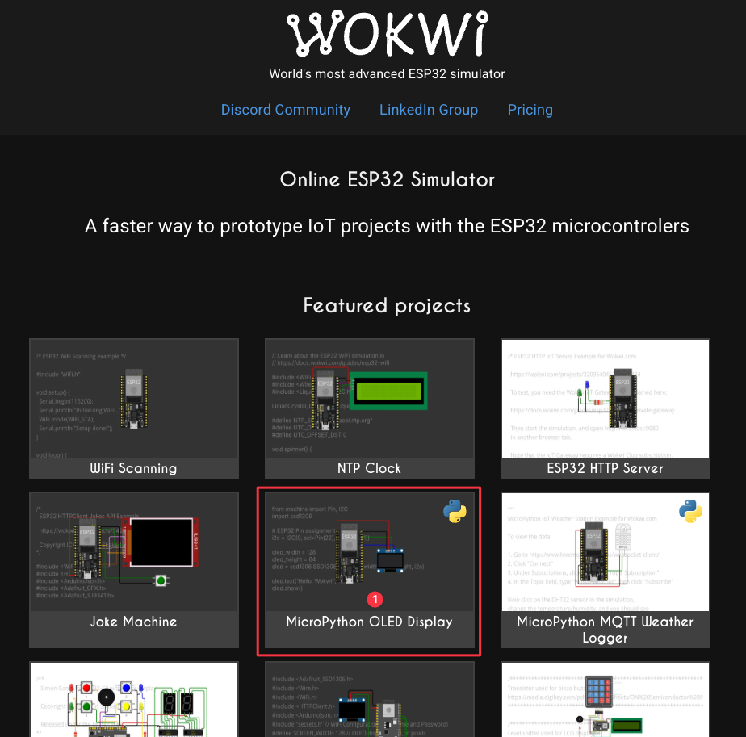
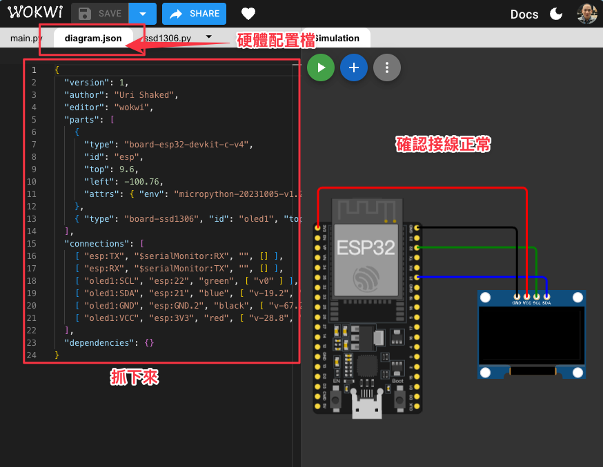
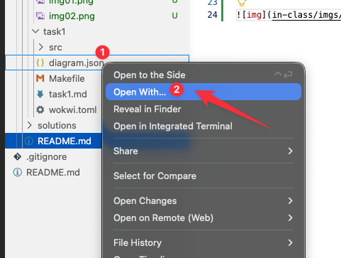
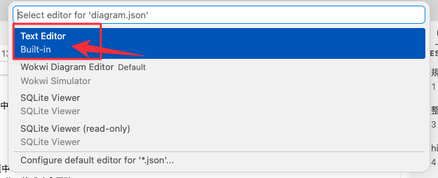
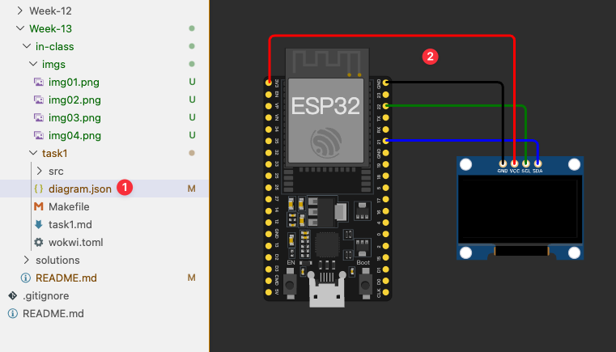

# Week 13

> 本週（Week 13）使用 ESP32 的 C 語言版本進行 Wokwi 程式實作。

## 1. 本週課堂作業

- 請依照 `in-class/` 內的題目與指示完成程式。
- 本週 Wokwi 開發板請統一使用 `ESP32`。
- 本週程式語言請使用 `C`。
- 本週解答請放在：`solutions/<你的學號>/`
- 送 PR 前請確認：檔案路徑正確、程式可編譯/可執行。

## 2. 調整硬體與下載 diagram.json

1) 打開 [Wokwi](https://wokwi.com/) 中的 MicroPython OLED Display

2) 確認右手邊的硬體配置是符合需求的。
3) 切換到硬體配置檔 `diagram.json` 分頁中
4) 抓下來配置檔的所有內容。確認要有大括號包住，格式才會正確。

5) 以**文字格式**開啟硬體配置檔 `diagram.json` 

6) 貼上硬體配置內容後，存檔/關閉。
7) 再開啟硬體配置檔 `diagram.json` 

## 3. 送程式到 ESP 32 之中

1) 確認 **終端機** 的工作目錄