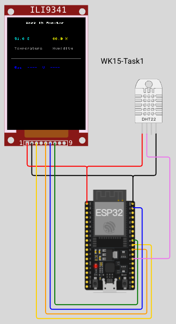

# Task 1: ILI9341 彩屏 + DHT22 溫濕度顯示

## 目標
本題使用 ESP32 透過 **SPI** 通訊驅動 ILI9341 全彩 TFT LCD（240×320），並讀取 DHT22 溫濕度感測器在螢幕上顯示文字。

**這是本週最重要的第一步**：從 I2C OLED 升級到 SPI 全彩 LCD。



## 快速開始

1. VS Code 開啟 `Command Palette` (`Cmd+Shift+P`) → `Wokwi: Start Simulator`
2. 在新的 Terminal 執行：
   ```bash
   make run
   ```

ILI9341 元件說明：[docs.wokwi.com/parts/wokwi-ili9341](https://docs.wokwi.com/parts/wokwi-ili9341)

## 硬體元件
| 元件 | Wokwi 類型 |
|------|-----------|
| ESP32 | `board-esp32-devkit-c-v4` |
| TFT LCD | **`wokwi-ili9341`**（240×320, 全彩, SPI 介面） |
| 溫濕度感測器 | `wokwi-dht22` |

## 接線

### ILI9341 TFT LCD（SPI！）
| ILI9341 腳位 | 連到 ESP32 | 說明 |
|-------------|-----------|------|
| VCC | 3V3 | 電源 |
| GND | GND | 接地 |
| CS | **GPIO5** | Chip Select（SPI 片選） |
| D/C | **GPIO17** | Data/Command 選擇 |
| MOSI | **GPIO23** | SPI 資料線（主出從入） |
| SCK | **GPIO18** | SPI 時脈 |

> ⚠️ **SPI 跟 I2C 不一樣！** OLED 用 I2C 只要 2 條線（SDA/SCL），SPI 需要 4 條線（CS、DC、MOSI、SCK），速度更快，適合全彩顯示。

### DHT22（注意 pin 已改）
| DHT22 | 連到 ESP32 | 說明 |
|-------|-----------|------|
| DATA | **GPIO4**（← 改了！） | 原本 Week 13 用 GPIO23，但被 SPI MOSI 佔用 |
| VCC | 3V3 | 電源 |
| GND | GND | 接地 |

### pin-to-pin 速查
| ILI9341 | ESP32 | DHT22 |
|---------|-------|-------|
| VCC | 3V3 | VCC |
| GND | GND | GND |
| CS | GPIO5 | — |
| D/C | GPIO17 | — |
| MOSI | GPIO23 | — |
| SCK | GPIO18 | — |
| — | GPIO4 | DATA |

## SPI 初始化重點

MicroPython 的 SPI 初始化方式完全不同於 I2C：
```python
from machine import Pin, SPI
import ili9341

spi = SPI(2, baudrate=40_000_000, sck=Pin(18), mosi=Pin(23))
cs = Pin(5, Pin.OUT)
dc = Pin(17, Pin.OUT)
display = ili9341.ILI9341(spi, cs=cs, dc=dc)
```

- `SPI(2)` = 使用 ESP32 的 VSPI 硬體介面
- `baudrate=40_000_000` = 40MHz SPI 時脈
- `cs` = 片選（Chip Select），告訴 LCD「我要跟你說話」
- `dc` = 資料/命令選擇，`0`=命令、`1`=資料

## 主要程式架構

```python
# TODO 1: 用 display.fill() 清除畫面
#       使用 ili9341.color565(0, 0, 0) 填黑

# TODO 2: 用 display.text() 顯示 "Week 15 Monitor" 白色標題
#       白色 = ili9341.color565(255, 255, 255)

# TODO 3: 顯示溫度數值（黃色）
#       黃色 = ili9341.color565(255, 255, 0)

# TODO 4: 顯示濕度數值（青色）
#       青色 = ili9341.color565(0, 255, 255)

# TODO 5: 顯示 "Temperature" 和 "Humidity" 標籤
#       使用灰色 ili9341.color565(128, 128, 128)
```

`main.py` 已提供骨架，學生需依 TODO 補完顯示邏輯。

## 顏色參考

| 顏色 | RGB | `color565()` |
|------|-----|-------------|
| 白色 | (255,255,255) | `ili9341.color565(255, 255, 255)` |
| 黃色 | (255,255,0) | `ili9341.color565(255, 255, 0)` |
| 青色 | (0,255,255) | `ili9341.color565(0, 255, 255)` |
| 綠色 | (0,255,0) | `ili9341.color565(0, 255, 0)` |
| 紅色 | (255,0,0) | `ili9341.color565(255, 0, 0)` |
| 灰色 | (128,128,128) | `ili9341.color565(128, 128, 128)` |
| 黑色 | (0,0,0) | `ili9341.color565(0, 0, 0)` |

## 提示
- `display.fill()` 會填滿整個畫面，在畫新資料前先清除舊畫面。
- `display.text(x, y, "文字", color)` 的 x/y 是左上角座標。
- 螢幕解析度 240×320，x 範圍 0~239，y 範圍 0~319。
- `display` 沒有 `show()` 方法（ILI9341 直接寫入顯示），但為了相容性保留了一個空實作。
- 如果在 Wokwi 中畫面沒更新，檢查 SPI 接腳是否正確：MOSI=GPIO23, SCK=GPIO18, CS=GPIO5, D/C=GPIO17。

## 執行
在 `task1` 目錄執行：
```bash
make run
```

若缺少 `pyserial`：
```bash
python3 -m pip install pyserial
```

成功時 Terminal 會顯示：
```
Uploading lib/ili9341.py
Running main.py
[DEBUG] temperature = 24.0C, humidity = 53.0%
```

## 驗收標準
- [ ] LCD 顯示「Week 15 Monitor」白色標題
- [ ] LCD 顯示溫度數值（黃色）
- [ ] LCD 顯示濕度數值（青色）
- [ ] Serial Console 輸出 debug 訊息
- [ ] 每 2 秒自動更新

---

## 本題學到的事

### 1. SPI 通訊（新！）
不同於 Week 13 的 I2C OLED，ILI9341 使用 **SPI** 需要 4 條控制線：CS（片選）、D/C（資料/命令）、MOSI（資料）、SCK（時脈），速度比 I2C 快很多。

### 2. MADCTL 暫存器與掃描方向
顯示器有一個方向控制暫存器 `0x36`（MADCTL），其中的 **MX bit** 控制水平掃描方向：
- `0x00`：column 從左到右（一般預設）
- `0x40`（MX=1）：column 從右到左 — **Wokwi 的 ILI9341 需要這個**

Wokwi 模擬的 ILI9341 硬體掃描方向與常見 datasheet 預設相反，必須設 MX=1 才能正常顯示，否則文字和佈局會左右鏡像。

> Adafruit 函式庫用 `0x48`（MX=1 + BGR=1），但那是因為 Adafruit 硬體額外需要 BGR 色彩反轉。Wokwi 只需要 `0x40`（MX=1，RGB 維持不變）。

### 3. 記憶體管理
`fill()` 若一次配 `240 × 320 × 2 = 153,600 bytes` 會讓 ESP32 heap 碎裂，第二次呼叫就 crash。解法：一次只配一列（480 bytes），逐列寫入，CS 全程 low。

### 4. 靜態佈局 + 局部更新
不要每輪重繪全螢幕（慢 + 閃爍）。改成：
- **loop 外**：畫一次靜態內容（標題、標籤、分隔線）
- **loop 內**：`fill_rect()` 擦掉舊數值區域，再 `text()` 寫新值

### 5. CS 時序（SPI 晶片選擇）
CS 在 command 與 data 之間不能隨意拉 high，否則 ILI9341 可能誤判交易邊界。正確做法：從 window 設定到 pixel data 寫完，CS 全程保持 low。

### 6. framebuf 文字渲染
用 `MONO_HMSB` 逐 pixel 寫入極慢。改用 `RGB565` framebuf 一次性 `_write_data(buf)`，微控制器上注意 byte order（framebuf 存 little-endian，ILI9341 吃 big-endian）。
