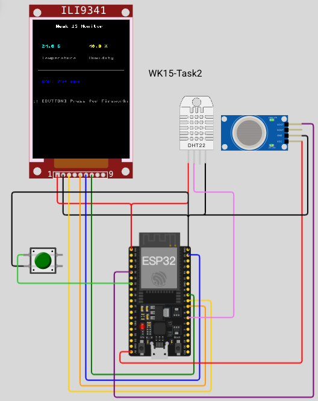
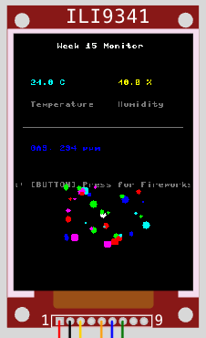

# Task 2: MQ2 氣體感測 + 按鈕煙火動畫

## 目標
在 Task 1 的基礎上，加入 **MQ2 氣體感測器**（ADC 類比輸入）與 **按鈕**（數位輸入），並在 ILI9341 上畫出**全彩煙火動畫**。





## 新增硬體元件
| 元件 | Wokwi 類型 | 接腳 | 新概念 |
|------|-----------|------|-------|
| 氣體感測器 | [`wokwi-gas-sensor`](https://docs.wokwi.com/parts/wokwi-gas-sensor)（MQ2） | AO → **GPIO34** | ADC 類比輸入 |
| 按鈕 | [`wokwi-pushbutton`](https://docs.wokwi.com/parts/wokwi-pushbutton) | 一腳 → **GPIO32**，另一腳 GND | 數位輸入 + 內部上拉 |

## 接線（pin-to-pin）

| ILI9341 | ESP32 | DHT22 | MQ2 | 按鈕 |
|---------|-------|-------|-----|------|
| VCC | 3V3 | VCC | — | — |
| GND | GND | GND | GND | — |
| CS | GPIO5 | — | — | — |
| D/C | GPIO17 | — | — | — |
| MOSI | GPIO23 | — | — | — |
| SCK | GPIO18 | — | — | — |
| — | GPIO4 | DATA | — | — |
| — | GPIO34 | — | AO | — |
| — | VIN(5V) | — | VCC | — |
| — | GPIO32 | — | — | 1.l |
| — | GND | — | — | 2.l |

## 新概念

### ADC（類比數位轉換）
MQ2 的 AO 輸出**類比電壓**（0~3.3V），濃度越高電壓越高。ESP32 用 ADC 讀取：

```python
from machine import ADC

gas_adc = ADC(Pin(34))
gas_adc.atten(ADC.ATTN_11DB)   # 設定 0~3.3V 範圍
raw = gas_adc.read()            # 回傳 0~4095
voltage = raw / 4095 * 3.3      # 換算電壓
```

- `ATTN_11DB`：衰減 11dB，讓 ADC 可以量測 0~3.3V（預設只有 0~1V）
- `read()` 回傳 12-bit 數值（0~4095）

### PPM（百萬分之一濃度）
Wokwi 的 gas sensor 有 `ppm` 屬性（預設 400），AO 電壓與 PPM 成正比，因此用線性公式：

```python
MAX_PPM = 290

def raw_to_ppm(raw):
    return int(raw * MAX_PPM // 4095)

| ADC 原始值 | 比例 | PPM（MAX_PPM=290） |
|-----------|------|--------------------|
| 0 | 0% | 0 |
| ~1000 | ~24% | ~71 |
| ~2000 | ~49% | ~142 |
| ~3000 | ~73% | ~212 |
| 3543 | ~87% | 251（Wokwi config）|
| 4095 | 100% | 290 |

### 按鈕（數位輸入 + 內部上拉）
```python
from machine import Pin

btn = Pin(32, Pin.IN, Pin.PULL_UP)
if btn.value() == 0:      # 按下去 = LOW
    launch_fireworks()
```

- `PULL_UP`：啟用 ESP32 內部上拉電阻，沒按時讀到 `1`，按下（接 GND）讀到 `0`
- 不需要外接電阻

## TODO 列表

`main.py` 中有 6 個 TODO：

| TODO | 主題 | 說明 |
|------|------|------|
| 1 | MQ2 ADC 初始化 | `ADC(Pin(34))` + `atten(ATTN_11DB)` |
| 2 | 按鈕初始化 | `Pin(32, Pin.IN, Pin.PULL_UP)` |
| 3 | 讀取氣體濃度 | `raw = gas_adc.read()` 後用 `raw_to_ppm()` 換算 PPM |
| 4 | 顯示氣體數值 | 更新 LCD 上的 GAS 行，顯示 `xxx ppm` |
| 5 | 按鈕觸發煙火 | `btn.value() == 0` 時啟動 |
| 6 | 煙火動畫函式 | 升空 + 爆炸 |

## 煙火動畫設計

### 升空階段
從畫面底部（y=300）到頂部（y=100），每 2px 畫一個白色圓點：
```python
display.fill_circle(120, 300, 4, WHITE)
for y in range(298, 100, -2):
    display.fill_circle(120, y + 2, 4, BLACK)  # 擦掉舊點
    display.fill_circle(120, y, 4, WHITE)       # 畫新點
    time.sleep_ms(5)
display.fill_circle(120, 100, 4, BLACK)         # 擦掉升空點
```

> 不直接用 `display.fill()` 清全螢幕（太慢），改為只擦掉 + 重畫單一圓點。

### 爆炸階段
隨機 70 個彩色粒子散射：
```python
colors = [RED, GREEN, BLUE, YELLOW, 紫色]
for _ in range(70):
    x = 120 + random.randint(-90, 90)
    y = 100 + random.randint(-80, 80)
    c = random.choice(colors)
    s = random.randint(2, 7)
    display.fill_circle(x, y, s, c)
```

### 煙火後恢復
煙火結束後重新繪製靜態佈局，讓 LCD 恢復顯示感測數據：
```python
if btn.value() == 0:
    launch_fireworks()
    draw_static()
```

## 顏色參考

| 顏色 | RGB | `color565()` |
|------|-----|-------------|
| 白色 | (255,255,255) | `ili9341.color565(255, 255, 255)` |
| 黃色 | (255,255,0) | `ili9341.color565(255, 255, 0)` |
| 青色 | (0,255,255) | `ili9341.color565(0, 255, 255)` |
| 綠色 | (0,255,0) | `ili9341.color565(0, 255, 0)` |
| 紅色 | (255,0,0) | `ili9341.color565(255, 0, 0)` |
| 藍色 | (0,0,255) | `ili9341.color565(0, 0, 255)` |
| 紫色 | (255,0,255) | `ili9341.color565(255, 0, 255)` |
| 灰色 | (128,128,128) | `ili9341.color565(128, 128, 128)` |
| 黑色 | (0,0,0) | `ili9341.color565(0, 0, 0)` |

## 提示
- MQ2 需要 **5V**（ESP32 的 VIN 腳位），Wokwi 模擬中不影響
- 修改 `MAX_PPM` 可校正 LCD 顯示值，讓它與 Wokwi 元件的 GAS (PPM) 一致
- 按鈕接 GND 的那一腳沒有極性，交換也可以
- 煙火動畫中不要用 `display.fill()` 清螢幕，改為只更新變動的圓點，速度才夠快
- 煙火結束後記得恢復顯示（呼叫 `draw_static()` 或重新繪製靜態內容）
- `time.sleep_ms()` 是 MicroPython 的毫秒延遲，不同於 `time.sleep()`
- `fill_circle()` 內部呼叫 `pixel()`（逐點繪製），大量粒子時會明顯變慢

## 實作中學到的教訓

### 1. MQ2 非線性校正

Wokwi 的 gas sensor 在不同 PPM 下輸出的 ADC 值**不是線性的**，用簡單比例換算會誤差很大：

```python
# ❌ 線性模型 — 誤差大
MAX_PPM = 290
def raw_to_ppm(raw):
    return int(raw * MAX_PPM // 4095)

# ✅ 非線性功率模型（MQ 系列感測器標準）
K = 2.60
P = 2.467

def raw_to_ppm(raw):
    v = raw / 4095.0
    if v >= 1.0:
        v = 0.999
    if v <= 0.0:
        return 0
    ratio = v / (1.0 - v)
    return int(K * (ratio ** P))
```

公式原理：`PPM = K × (v / (1-v))^P`
- `v = raw / 4095`：ADC 比例值（0~1）
- `v / (1-v)`：電壓分壓比，MQ2 的 AO 輸出與氣體濃度的關係接近這個形式
- `K`、`P`：透過實驗數據擬合得出的校正係數
- 當 `v` 接近 1（ADC 滿量程）時限制為 `0.999`，避免除以零

| ADC 原始值 | v | v/(1-v) | 線性 PPM | 非線性 PPM |
|-----------|---|---------|---------|-----------|
| 0 | 0.00 | 0.00 | 0 | 0 |
| 1000 | 0.24 | 0.32 | 71 | **0** |
| 2000 | 0.49 | 0.95 | 142 | **2** |
| 3000 | 0.73 | 2.74 | 212 | **19** |
| 3543 | 0.87 | 6.42 | 251 | **106** |
| 3800 | 0.93 | 12.88 | 269 | **390** |
| 3950 | 0.96 | 27.24 | 280 | **1641** |
| 4095 | 1.00 | — | 290 | — |

非線性模型對**低濃度更敏感**（低電壓時曲線陡峭），**高濃度時快速上升**，更符合實際 MQ2 特性。


## 執行
```bash
make run
```

## 驗收標準
- [ ] LCD 顯示即時氣體濃度（PPM）
- [ ] 按鈕按下時觸發全彩煙火動畫
- [ ] 煙火升空流暢、爆炸彩色粒子散開
- [ ] 煙火結束後 LCD 恢復顯示感測數據
- [ ] Serial Console 輸出所有感測器數值
