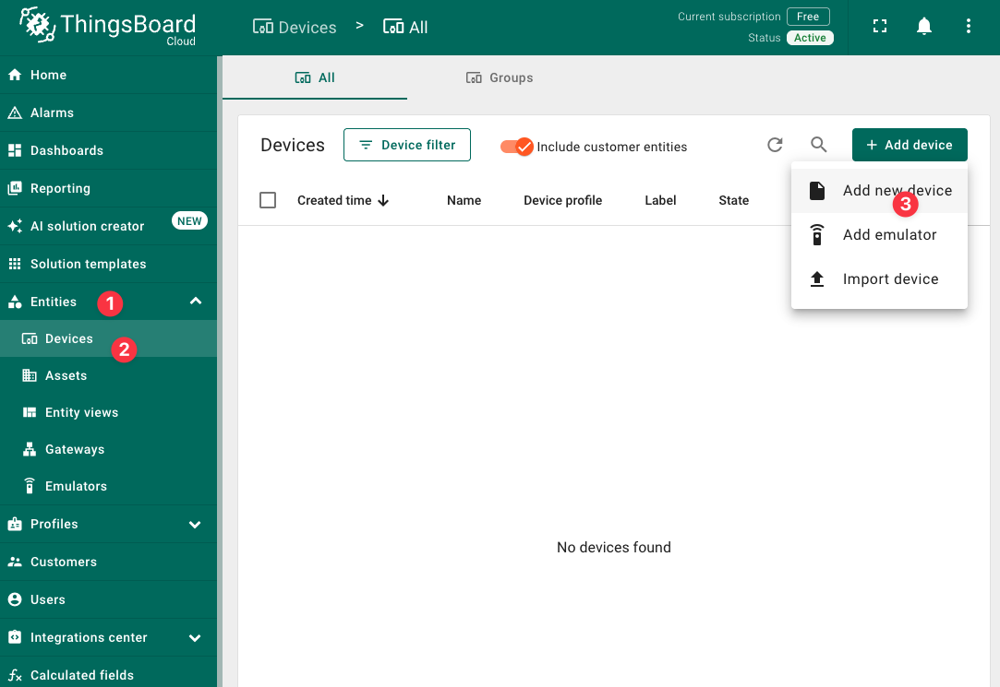
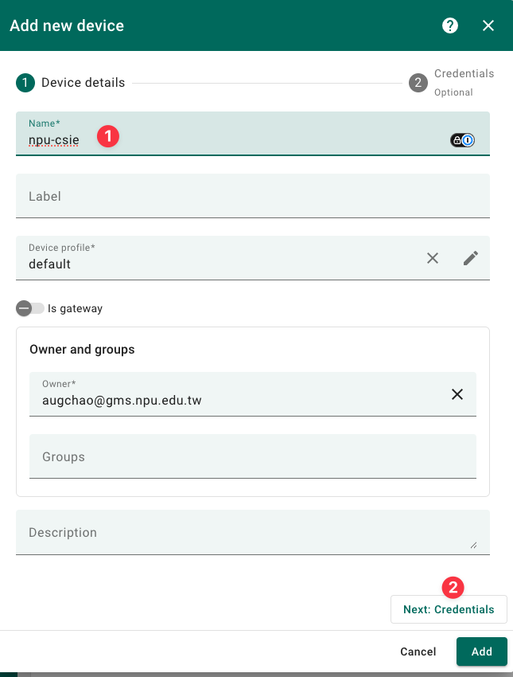
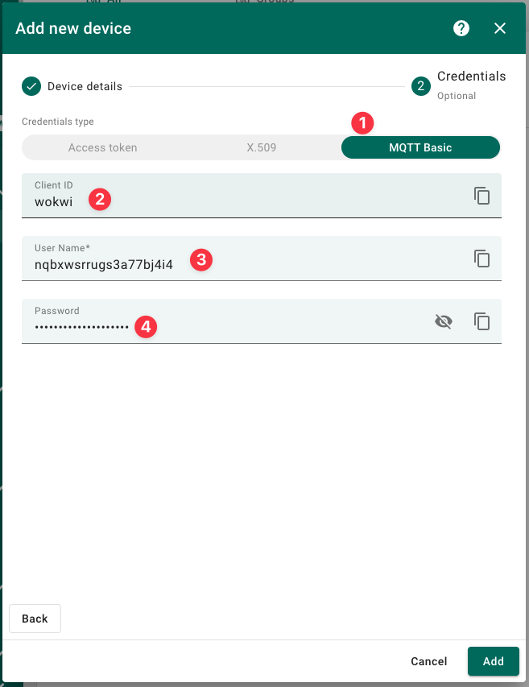
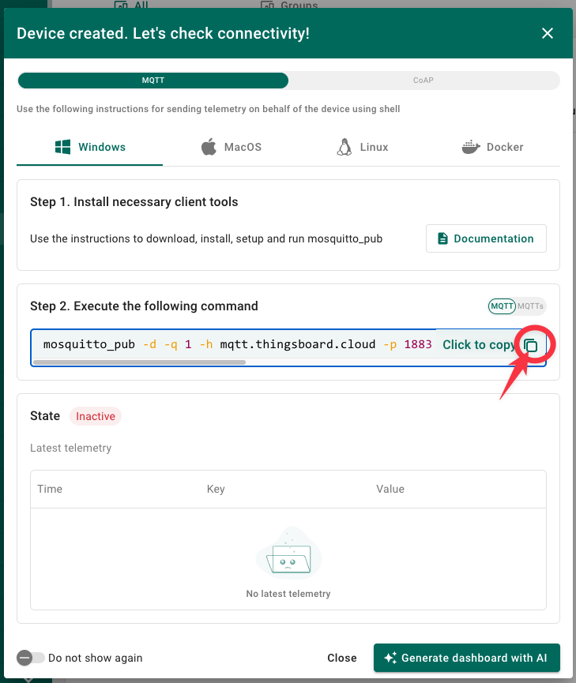
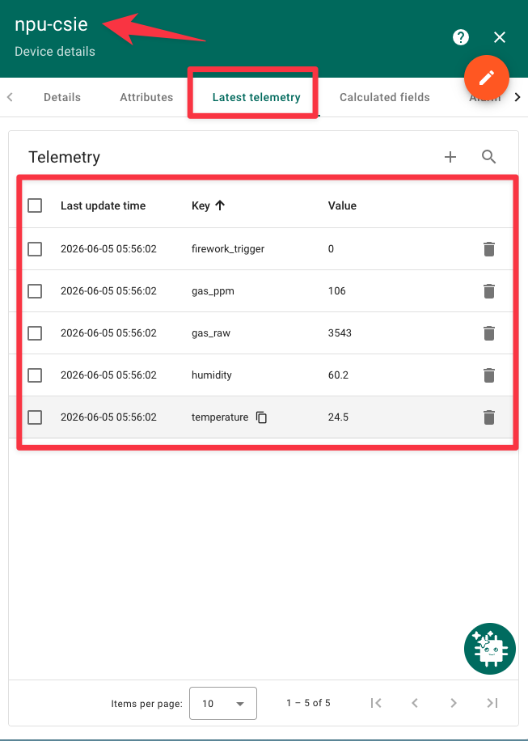
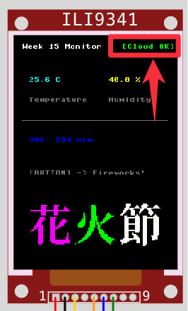
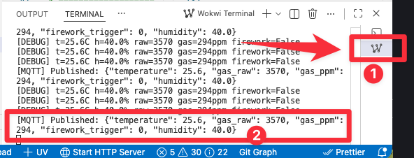

# Task 3: MQTT 上雲端 + ThingsBoard 儀表板

## 目標
在 Task 2 的感測資料基礎上，加入 **WiFi + MQTT**，將資料上傳到 ThingsBoard 雲端儀表板。

## 新增技術
- `network` — WiFi 連線
- `umqtt.simple.MQTTClient` — MQTT 協定 publish
- `ujson` — JSON 序列化

## ThingsBoard 操作指引

### Step 1：建立 Device

1. 登入 [thingsboard.cloud](https://thingsboard.cloud)
2. 右側 **Get started** 點 **Devices**
   （或左側選單 **Entities → Devices**）
3. 進到 Devices 後，按右上角 **＋** 或 **Add device**
4. 新增 Device：
   - **Name**：例如 `test-mqtt`
   - **Profile**：先用 `default`
   - 按 **Add**
5. 新增完後，點進這個 device



### Step 2：取得 Access Token

進到 device 詳細頁後，找 **Access token**：
- **Details** 分頁
- 或右上角 **Manage credentials / Credentials**

複製 token。



### Step 3：用 MQTT 測試

在本機用 mosquitto_pub 發送測試資料：

```bash
mosquitto_pub -h thingsboard.cloud -p 1883 \
  -u "你的_ACCESS_TOKEN" \
  -t "v1/devices/me/telemetry" \
  -m '{"temp":28.3}'
```

### Step 4：確認資料

回 ThingsBoard 該裝置頁，點 **Latest telemetry**，應該會看到 `temp = 28.3`。



### Step 5：填入 main.py

將取得的 token 填入 `main.py`：

```python
ACCESS_TOKEN = "你的_ACCESS_TOKEN"
```

## Telemetry 資料格式

| 欄位 | 來源 | 型態 | 說明 |
|------|------|------|------|
| `temperature` | DHT22 | float | 即時溫度 |
| `humidity` | DHT22 | float | 即時濕度 |
| `gas_raw` | MQ2 ADC | int | ADC 原始值 (0~4095) |
| `gas_ppm` | MQ2 換算 | int | 氣體濃度 PPM |
| `firework_trigger` | 按鈕事件 | bool (0/1) | 該筆資料是否觸發過煙火 |

## MQTT Publish 流程

```python
import network
import ujson
from umqtt.simple import MQTTClient

# WiFi
wlan = network.WLAN(network.STA_IF)
wlan.active(True)
wlan.connect(WIFI_SSID, WIFI_PASS)
while not wlan.isconnected():
    time.sleep_ms(500)

# MQTT
client = MQTTClient(client_id=b"esp32-001",
                    server=TB_HOST, port=1883,
                    user=ACCESS_TOKEN)
client.connect()

# Publish
telemetry = ujson.dumps({
    "temperature": t,
    "humidity": h,
    "gas_raw": raw,
    "gas_ppm": ppm,
    "firework_trigger": 1 if triggered else 0
})
client.publish(b"v1/devices/me/telemetry", telemetry)
```

## LCD 顯示變更

標題列右側顯示連線狀態：
- `[Cloud OK]` 綠色 — WiFi + MQTT 連線成功
- `[No Cloud]` 紅色 — 連線失敗




## ThingsBoard 儀表板建議

| Widget | 資料欄位 | 說明 |
|--------|---------|------|
| Digital display | `temperature` | 大字溫度 |
| Gauge | `humidity` | 0~100% 濕度計 |
| Timeseries chart | `temperature` + `humidity` | 雙曲線趨勢 |
| Timeseries chart | `gas_ppm` | 氣體歷史曲線 |
| Timeseries chart | `firework_trigger` | 事件標記 |

## 與 task2a 的差異

| | `task2a/` | `task3/` |
|--|---------|---------|
| WiFi | 無 | `network.WLAN` 連線 |
| MQTT | 無 | `umqtt.simple` publish |
| 雲端狀態 | 無 | LCD 標題列顯示連線狀態 |
| Telemetry | 無 | 定時上傳 JSON 到 ThingsBoard |
| firework_trigger | 無 | 煙火觸發時標記，重置後歸零 |

## 執行

```bash
make run
```

## 實作中學到的教訓

### 1. MQTT 連線除錯流程

Wokwi 的 `Wokwi-GUEST` WiFi 可以正常連線（拿到 `10.13.37.x` IP），但出問題時要分階段確認：

```
[WiFi] Connected: ('10.13.37.3', ...)   ✅ WiFi 通了
[MQTT] Failed: 5                         ❌ MQTT 被拒
```

錯誤碼 `5` = **not authorized**（MQTT CONNACK return code）。

### 2. ThingsBoard MQTT 認證方式

mosquitto_pub 驗證成功的指令：

```bash
mosquitto_pub -h mqtt.thingsboard.cloud -p 1883 \
  -t v1/devices/me/telemetry \
  -i "wokwi" \
  -u "nqbxwsrrugs3a77bj4i4" \
  -P "pzcgbajjh274h8jtri07" \
  -m '{"temperature":25}'
```

在 `umqtt.simple.MQTTClient` 中必須**同時給 `user` 和 `password`**，且值要跟 mosquitto_pub 完全一致：

```python
# ✅ 正確（比照 mosquitto_pub）
client = MQTTClient(client_id=b"wokwi",
                    server=TB_HOST, port=1883,
                    user=ACCESS_TOKEN,          # -u
                    password="pzcgbajjh274h8jtri07")  # -P

# ❌ 只給 user — error 5
client = MQTTClient(..., user=ACCESS_TOKEN)

# ❌ 只給 password — error 5
client = MQTTClient(..., password=ACCESS_TOKEN)
```

### 3. 先在本機用 mosquitto_pub 驗證

在把程式燒進 ESP32 之前，先用 `mosquitto_pub` 測試 credentials 是否有效：

```bash
mosquitto_pub -d -q 1 -h mqtt.thingsboard.cloud \
  -p 1883 -t v1/devices/me/telemetry \
  -i "wokwi" \
  -u "你的_TOKEN" \
  -P "你的_PASSWORD" \
  -m '{"temperature":25}'
```

加上 `-d`（debug）可以看到 `CONNACK (0)` 表示成功，`CONNACK (5)` 表示被拒。

### 4. Startup 顯示逐步狀態

改為在 `fill(BLACK)` 之後逐行顯示連線進度，而不是一次全部畫完：

```
Week 15 Monitor          ← 白色標題
WiFi: Wokwi-GUEST
WiFi OK
IP: 10.13.37.3
MQTT connecting...
MQTT OK
```

這樣可以肉眼看出卡在哪一步。

### 5. send_interval 改用 time.ticks_ms()

原本用 `publish_tick` 計數器方式不精確（受主迴圈速度影響），改用 `time.ticks_ms()` 計算時間差：

```python
last_publish_ms = 0

# 在主迴圈中
now = time.ticks_ms()
if now - last_publish_ms >= SEND_INTERVAL * 1000:
    last_publish_ms = now
    mqtt_publish(...)
```

## 驗收標準
- [ ] WiFi 連線成功，LCD 顯示 `[Cloud OK]`
- [ ] 每 10 秒 publish 一次 telemetry 到 ThingsBoard
- [ ] DHT22 溫濕度即時更新
- [ ] MQ2 氣體濃度讀取並顯示 PPM
- [ ] 按鈕觸發煙火時該次 publish 帶 `firework_trigger: 1`
- [ ] 煙火結束後恢復顯示
- [ ] ThingsBoard 儀表板可看到歷史曲線
