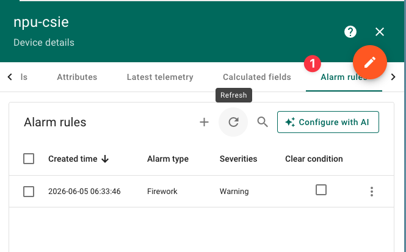
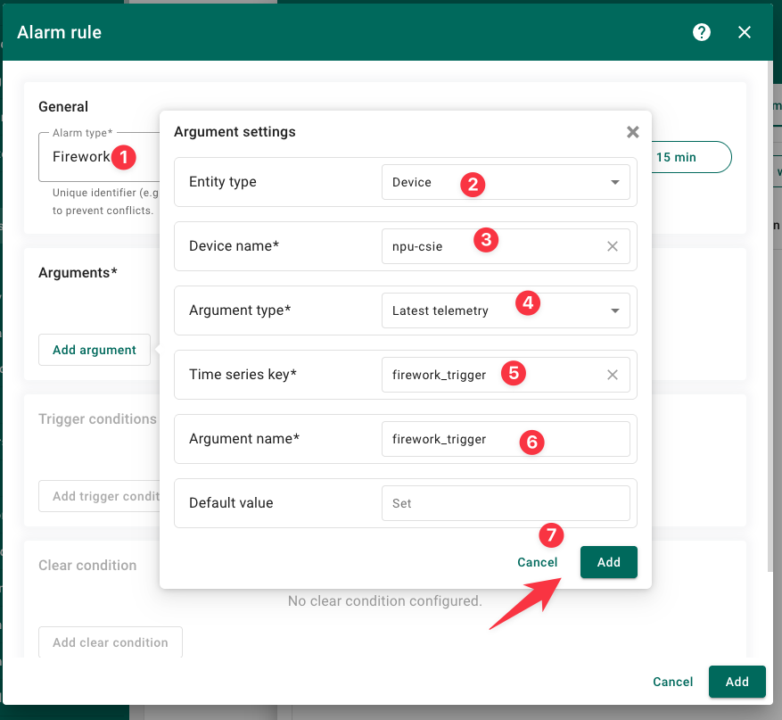
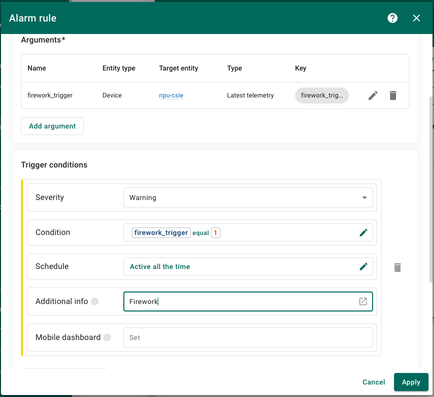
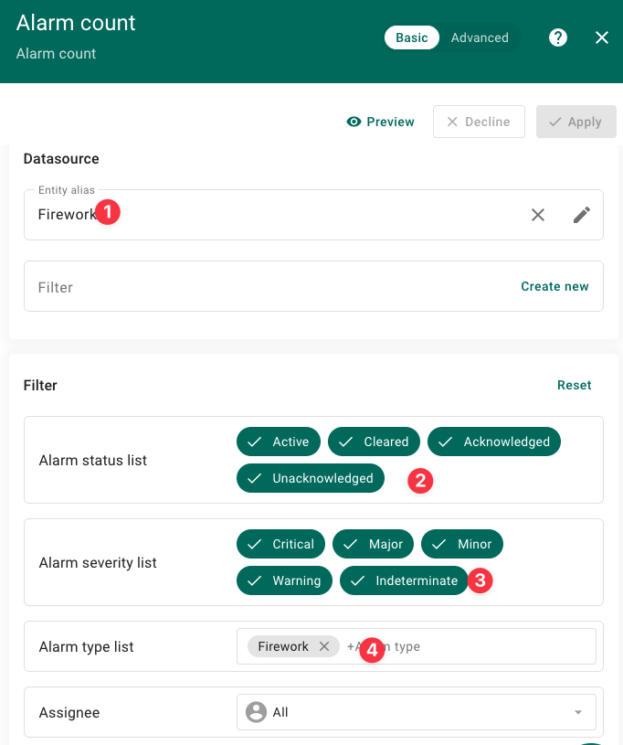
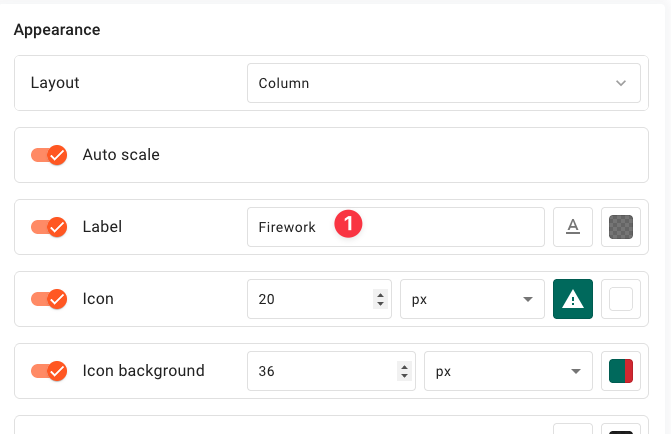
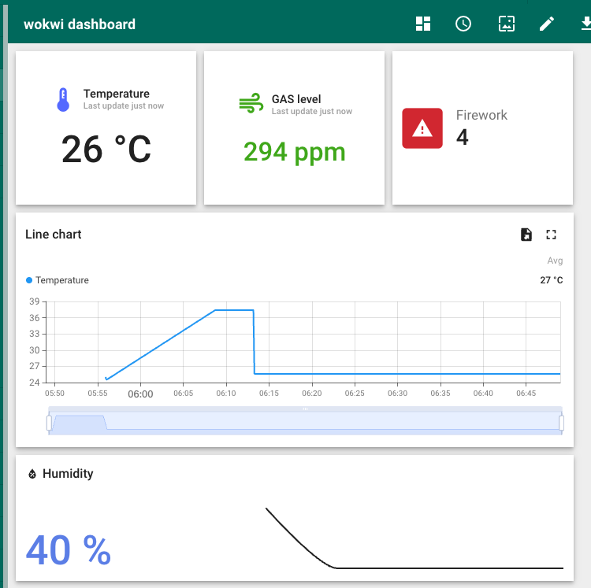

# Task 4 — ThingsBoard Dashboard

在 ThingsBoard Cloud 上建立儀表板，即時顯示 ESP32 上傳的感測數據與煙火事件。

## 前置條件

1. 完成 Task 3，ESP32 已成功上傳資料到 `thingsboard.cloud`
2. 你擁有 ThingsBoard 租戶帳號（或使用 `nqbxwsrrugs3a77bj4i4` 這台 Device）
3. 裝置已用 `ACCESS_TOKEN` 連線，`v1/devices/me/telemetry` 有持續收到資料

## 檢查裝置資料

開瀏覽器到 [https://thingsboard.cloud](https://thingsboard.cloud) 登入。

左側 **Devices** → 點你的裝置 → 切到 **Latest telemetry** 頁籤。

你應該看到：
```
temperature   25.3   (最近一次值)
humidity      68.0
gas_raw       1842
gas_ppm       289
firework_trigger  0
```

如果這裡是空的，表示 MQTT 還沒成功上傳 — 請先完成 Task 3。

## 建立儀表板

### Step 1 — 新增空白儀表板

1. 左側 **Dashboards** → 右上角 **+** → **Create new dashboard**
2. 填 Title: `Week 15 Monitor` → **Add**
3. 進入剛建立的儀表板，左下角齒輪 → **Edit**

### Step 2 — 加入第 1 個 Widget：Digital display (溫度)

1. 右上角 **+ Add widget**
2. 選擇 **Digital widgets** → **Digital display**
3. **Add** → 建立資料來源：
   - **Data key**: `temperature`
   - **Label**: `Temperature`
   - **Units**: `°C`
   - **Decimals**: `1`
4. **Advanced** → Title 設 `Temperature` → **Add**

### Step 3 — 加入第 2 個 Widget：Gauge (GAS 濃度)

1. 右上角 **+ Add widget**
2. 選擇 **Gauges** → **Round Gauge** (或 **Radial Gauge**)
3. **Add** → 建立資料來源：
   - **Data key**: `gas_ppm`
   - **Label**: `GAS Level`
   - **Units**: `ppm`
4. **Advanced**：
   - **Min value**: `0`
   - **Max value**: `500`
   - **Gauge range**: `0`～`500`
   - **Title**: `GAS Level`
5. → **Add**

### Step 4 — 加入第 3 個 Widget：Firework Trigger Alarm

1. **+ Add widget** → **Cards** → **Card with icon** (或 **Indicator widget**)
2. **Add** → 資料來源：
   - **Data key**: `firework_trigger`
   - **Label**: `Firework!`
3. **Advanced**：
   - **Show value** → 自訂文字
   - **Off value**: `0` → 顯示 `Ready`
   - **On value**: `1` → 顯示 `BOOM!`
   - **On icon color**: 紅色
   - **Title**: `Firework Alarm`
4. → **Add**








### Step 5 — 加入第 4 個 Widget：Temperature 歷史曲線

1. **+ Add widget** → **Charts** → **Timeseries Line Chart**
2. **Add** → 資料來源：
   - **Data key**: `temperature`
   - **Label**: `Temperature`
   - **Color**: 黃色
   - **Type**: `line`
3. **Advanced**：
   - **Time window**: `1 hour`
   - **Title**: `Temperature History`
4. → **Add**

### Step 6 — 加入第 5 個 Widget：Humidity 歷史曲線

1. **+ Add widget** → **Charts** → **Timeseries Line Chart**
2. **Add** → 資料來源：
   - **Data key**: `humidity`
   - **Label**: `Humidity`
   - **Color**: 青色
   - **Type**: `line`
3. **Advanced**：
   - **Time window**: `1 hour`
   - **Title**: `Humidity History`
4. → **Add**

### Step 7 — 排版

拖曳調整每個 Widget 的位置與大小。三個 Row 的布局：

```
┌───────────────┬───────────────┬────────────────┐
│  Digital       │  Round Gauge  │  Firework Card │
│  Display       │  (GAS Level)  │  (BOOM!/Ready) │
│  (Temperature) │               │                │
├───────────────┴───────────────┴────────────────┤
│           Timeseries Line Chart                │
│           (Temperature History)                │
├───────────────────────────────────────────────┤
│           Timeseries Line Chart                │
│           (Humidity History)                   │
└───────────────────────────────────────────────┘
```



### Step 8 — 發布儀表板

右上角 **Save** → 回到 Dashboard 列表 → 點 Dashboard 右邊的 **Make public** (或設定分享連結)。

---

## 設置 Firework Alarm（設備警報）

按下按鈕除了 LCD 放煙火，還要讓 ThingsBoard 產生一筆 **Alarm（警報）**，並發出通知。

### 原理

ThingsBoard 的 Alarm 機制是：當某個 telemetry key 達到設定條件時，自動建立一筆警報記錄。我們讓 `firework_trigger = 1` 時觸發 **CREATE**，`firework_trigger = 0` 時自動 **CLEAR**。

設定在 **Device Profile** 中，而非個別 Device — 同一個 Profile 的所有裝置共用這條規則。

### Step A — 進入 Device Profile

1. 左側 **Profiles** → **Device Profiles**
2. 找到你的 Device 使用的 Profile（預設是 `default`）→ 點進去
3. 切到 **Alarm Rules** 頁籤 → 右上角 **+ Add alarm rule**

### Step B — 建立 Alarm Rule

填寫以下內容：

| 欄位 | 設定值 |
|------|--------|
| **Alarm Type** | `Firework Alert` |
| **Create Key** | `firework_trigger` |
| **Create Condition** | `firework_trigger` `equals` `1` |
| **Severity** | `Warning`（或 Critical，看你喜好）|
| **Propagate** | 勾選 **Propagate to all relations** |
| **Clear Key** | `firework_trigger` |
| **Clear Condition** | `firework_trigger` `equals` `0` |

設定畫面長這樣（僅示意，實際欄位名稱可能依版本微調）：

```
Alarm Type:      Firework Alert
Create Rules:
  Key:           firework_trigger
  Condition:     firework_trigger  equals  1    →  CREATE Alarm
Clear Rules:
  Key:           firework_trigger
  Condition:     firework_trigger  equals  0    →  CLEAR Alarm
```

完成後 **Save**。

### Step C — 設定通知（可選）

ThingsBoard 可以讓 Alarm 觸發時發 Email 或 Webhook 通知。

1. 左側 **Profiles** → **Device Profiles** → 你的 Profile
2. 切到 **Alarm Rules** → 點剛剛建立的 `Firework Alert` 右側鉛筆
3. 往下找到 **Advanced → Notifications**
4. 選擇通知方式（需先設定過 Email 或 SMS 提供者）：

   - **Email**：寄信到指定信箱
   - **SMS**：簡訊（需 Twilio）
   - **Webhook**：呼叫外部 API

   課堂上最簡單的是 Email，設定方式：
   - 左側 **Main → Outgoing Mail** → 設定 SMTP（如 Gmail）
   - 回到 Alarm Rule 的 Notifications 勾選 **Send email** → 填入收件者

### Step D — 檢查 Device 的 Alarm 清單

1. 左側 **Devices** → 點你的裝置
2. 切到 **Alarms** 頁籤

按下按鈕後，這裡應該會出現一筆 Alarm：

```
Type: Firework Alert
Severity: Warning
Status: Active
Start Time: 2026-06-05 12:34:56
```

5 秒後 `firework_trigger` 歸零 → Alarm 自動變成 **Cleared**。

---

## 測試方式

1. 按下 ESP32 上的 Button → 觸發煙火
2. 觀察 ThingsBoard：
   - `firework_trigger` 瞬間變成 1
   - Firework 卡顯示 **BOOM!**
   - **Device → Alarms** 出現一筆 `Firework Alert`（Active）
3. 約 5 秒後：
   - `firework_trigger` 自動歸零回到 0
   - **Device → Alarms** 的 `Firework Alert` 變成 **Cleared**
4. （若有設 Email）同時會收到 Notification 信件

## 常見問題

### Widget 顯示 "No data"
- 確認 Device 的 **Latest telemetry** 有最新值
- 檢查 Widget 的 **Data source** 是否用了正確的 Device 與 Key

### 濕度 Gauge 不會動
- 確認 **Min/Max value** 設為 0 和 100
- 如果還是停在 0，手動輸入一個測試值檢查

### Timeseries 只看得到一點
- **Time window** 設太短 — 調大到 1 hour
- ESP32 重開後資料會中斷，等幾分鐘收集多點

## 總結

Dashboard 不需要修改 ESP32 程式碼 — 所有設定都在 ThingsBoard Web UI 完成。成功後你就能從瀏覽器即時看到感測器數據，不需要接 USB 看 Serial Monitor。
